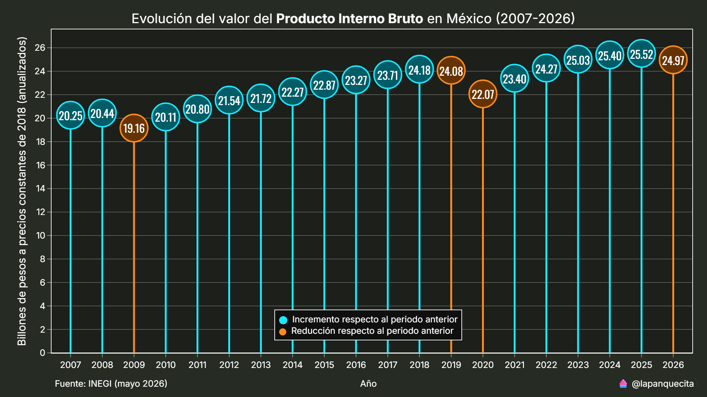
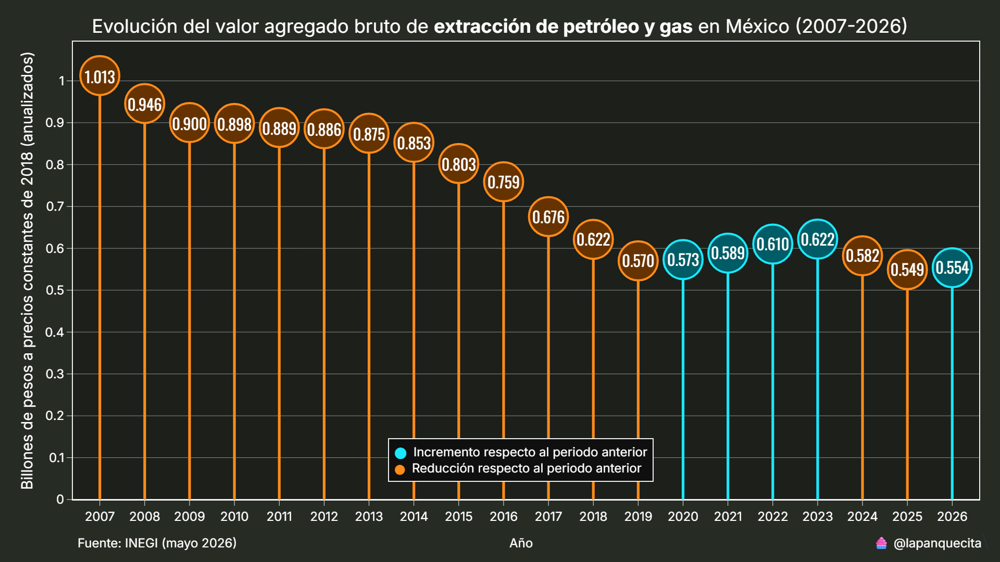
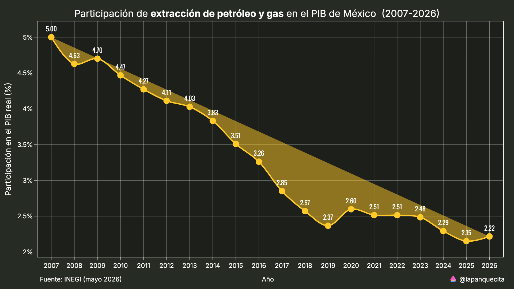
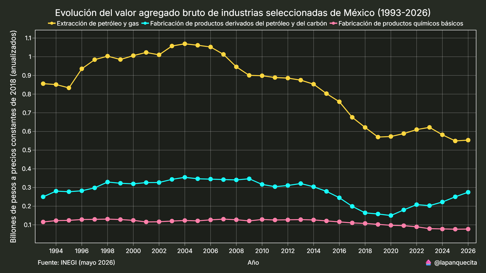

# PIB de México

Este proyecto tiene como objetivo analizar el Producto Interno Bruto (PIB) de México desde una perspectiva sectorial y territorial, utilizando información desagregada por industria y por entidad federativa. Para la clasificación de las actividades económicas se emplea el Sistema de Clasificación Industrial de América del Norte (SCIAN), lo que permite realizar análisis consistentes y comparables entre los distintos sectores productivos del país.

El Producto Interno Bruto (PIB) es el principal indicador para medir el valor monetario de los bienes y servicios finales producidos dentro del territorio nacional durante un periodo determinado. En este proyecto, el análisis del PIB permite identificar la contribución económica de cada industria y su distribución geográfica, proporcionando una visión integral de la estructura productiva de México.

Es importante señalar que el PIB mide la producción de bienes y servicios, pero no constituye un indicador del bienestar de la población, la distribución del ingreso, la calidad de vida, la sostenibilidad ambiental o la economía informal. En consecuencia, los resultados presentados deben interpretarse como una medida de la actividad económica y no como una evaluación del desarrollo social o del nivel de vida de las entidades federativas o de las industrias analizadas.

## Fuentes de datos

La información utilizada en este proyecto proviene de fuentes oficiales del Instituto Nacional de Estadística y Geografía (INEGI), garantizando la consistencia metodológica y la confiabilidad de los datos empleados en el análisis.

* Producto Interno Bruto por industria
  Contiene las series del Sistema de Cuentas Nacionales de México con información del PIB desagregada por actividad económica, utilizando el Sistema de Clasificación Industrial de América del Norte (SCIAN).
  [https://www.inegi.org.mx/temas/pib/#tabulados](https://www.inegi.org.mx/temas/pib/#tabulados)

* Producto Interno Bruto por entidad federativa
  Contiene información anual del PIB para las 32 entidades federativas, desagregada por actividad económica y publicada en formato de datos abiertos.
  [https://www.inegi.org.mx/programas/pibent/2018/#datos_abiertos](https://www.inegi.org.mx/programas/pibent/2018/#datos_abiertos)

## PIB por industria

El script `industrias.py` se encarga del procesamiento y análisis del Producto Interno Bruto (PIB) por industria a nivel nacional. Los datos provienen del Sistema de Cuentas Nacionales de México y están desagregados por actividad económica conforme al SCIAN.

Esta fuente cuenta con un mayor nivel de detalle que la base de datos estatal, al incluir un mayor número de industrias, lo que permite realizar análisis sectoriales más específicos de la estructura productiva del país.

La información tiene una periodicidad trimestral y se actualiza conforme el INEGI publica nuevos datos.

### Evolución anual

Mediante un gráfico tipo lollipop se muestra la evolución anual del valor de una industria específica durante los últimos 20 años, expresada en pesos constantes de 2018. Esta visualización permite analizar la trayectoria de largo plazo de una actividad económica, eliminando el efecto de los cambios en precios.

La función es personalizable y permite seleccionar cualquier industria disponible en el conjunto de datos, así como indicadores agregados como el PIB, el Valor Agregado Bruto (VAB) o las actividades primarias, secundarias y terciarias.

### Participación del PIB

Esta función visualiza la evolución de la participación de una industria específica como porcentaje del PIB nacional durante los últimos 20 años. El cálculo se realiza utilizando valores en pesos constantes de 2018, lo que permite analizar los cambios en la estructura productiva sin el efecto de las variaciones en precios.

### Comparación industrias

Esta función genera un gráfico de múltiples líneas que permite comparar la evolución del valor económico de distintas industrias desde 1993, año en que inicia el registro disponible en la base de datos.

Los valores se expresan en pesos constantes de 2018, permitiendo analizar el crecimiento y comportamiento relativo de cada industria a lo largo del tiempo sin el efecto de las variaciones en precios.

## PIB estatal

El análisis del PIB por entidad federativa utiliza información anual publicada por el INEGI, con datos desagregados por estado y actividad económica conforme al SCIAN.

A diferencia del PIB por industria a nivel nacional, esta base de datos cuenta con un menor nivel de desagregación y un número más limitado de industrias disponibles. Sin embargo, la información es suficiente para realizar comparaciones entre entidades federativas y analizar la estructura productiva regional del país.

